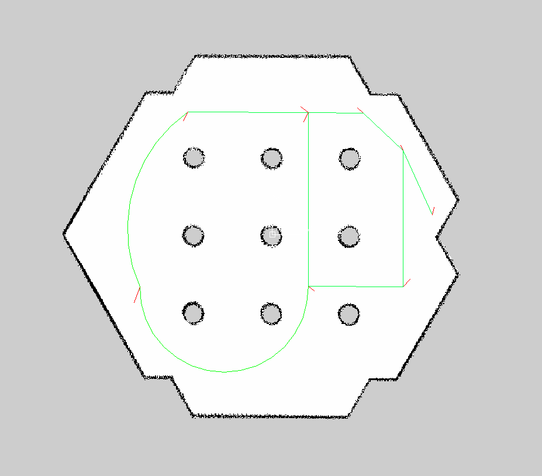

## How to draw paths in CAD
##### Add image to CAD
* Convert your ros map representation (.pgm) to .png image file. Notice image width (px).
* Check your map metadata (map.yaml). Notice origin position and map resolution
* Insert your .png image to CAD. As insertion position use map origin (from map metadata). Scale image, 
  the image width [m] in CAD should be as result of `image_width_px * map_resolution`
  
##### Drawing rules
* Create a line as path (path line) with default color. Arc can be also used.
* Create another line (arrow line) which will mark of path direction. Color of this line have to be another 
  as default line color. Path line and arrow lines should have just one intersection point.
* Select path line and arrow lines and create block from them. Block name have to contain string `path`
* Path created in this way will be correctly parsed and graph generated.

* Every block can contain only line/arc and any number of arrow lines.
* Lines which marks arrow have to have another line color as is default line color.
* Blocks can not contain scale

## Known issues
* Non handled case when drown path length is shortest as maxEdgeLength parameter 
* Arcs can not be parsed as bidirectional routes
